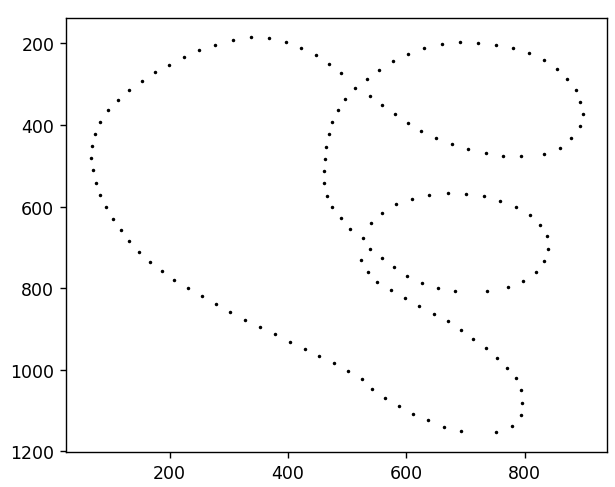
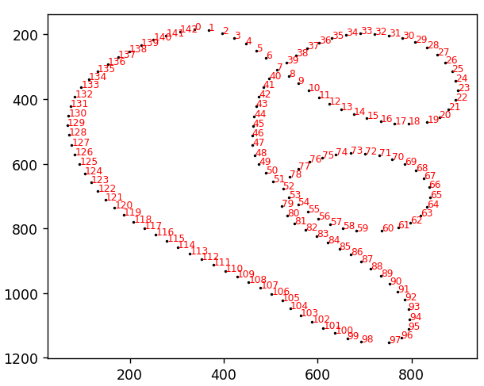
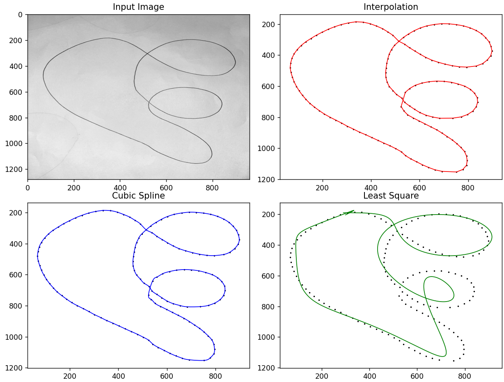
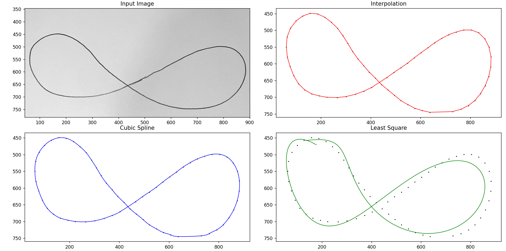

# Computational Project 1

## Intro

The images used for testing during the development process were hand-drawn by me on a white piece of paper with a blue pen. For this reason, I convert the input image to grayscale using the `convert_to_grayscale` function. You can find the images I worked with attached to the Assignment. They include both overlapping and non-overlapping closed curves.

## Usage

You can simply run the program and change the arguments of the `run` function to the path of the desired image to test. Other parameters can also be adjusted to optimize the output.

## Criteria

I understand that some strokes of pen may be thicker than other. To avoid to many points plotted, I only leave those dots on the plot that do not lay in a certain radius. `radius` parameter is used for that.
While testing code I have found some optimal values that can be changed according to the input image.
- o_radius4_overlapping_curve = 30
- o_radius4_close_edged_curve = 70
- o_radius4_n_overlapping_curve = 100
  
The smaller the value more dots will be left on plot. From the name you can understand that closed curves with overlapping edges need more dots to maintain correct order. As default value I give it `100` since with more dots you are always ensured that no loss of overlapping loops would happen, you can put it to `30` if you are testing circle or other non overlapping closed curves

Another criteria is how dark input images are, for my test cases `threshold` of `88` was enough. If desired you may change it. Bigger value will count more brighter pixels. One use case is very thin or ambient line.

## Development process

First what I do is I traverse the input image grayscaled matrix and save the coordinated of pixels darker than my threshold. After that with `merge_dots` function I merge all dots into one to get rid of thickness of drawing and some nearby dots maybe.

After that I have written an algorithm for ordering the dots in my list of dot coordinates. Before they came in order from left top most to the right bottom, but now I approximate next dot with the function `order_dots_smoothness_and_proximity`. It utilizes the cosine between the nearby points and calculated the smoothness to it. A value closer to 1 indicates a smoother path, while a value closer to 0 indicates a sharper turn. While also taking how far the dot is from it.

With ordered dots I am fitting the curves with methods asked in the problems statement with not much trouble

## Method Comparison

In this project, we use three different fitting techniques to process the image data: interpolation, cubic spline, and least squares. Each method has its own strengths and weaknesses, and they are used in different tasks.

- **Interpolation (Task 2)**: The `plot_interpolation` function is used to fit a curve that passes through each dot in the image. This method is simple and effective, but it can create unrealistic curves if the dots are not evenly distributed. The error in this method can be high if the function being interpolated is not smooth or if it contains a lot of noise. However, for smooth functions or evenly distributed data, this method can provide a very accurate fit.

- **Cubic Spline (Task 3)**: The `plot_cubic_spline` function is used to fit a smooth curve that passes through each dot. This method can create more realistic curves than simple interpolation, especially for complex shapes. However, it can be more computationally intensive. The error in this method is generally lower than in simple interpolation, especially for functions that are not smooth. The cubic spline method also has good proximity properties, meaning that the fitted curve stays close to the data points.

- **Least Squares (Task 4)**: The `plot_least_squares` function is used to fit a curve that minimizes the sum of the squares of the residuals (the differences between the observed and predicted values). This method can provide a good fit even if the dots are not evenly distributed, but it may not pass through each dot. The error in this method is minimized by design, but it can be sensitive to outliers. The least squares method also has good proximity properties, especially for data that is not evenly distributed.

Each of these methods is visualized in a separate subplot in the output image. By comparing these methods, we can gain a better understanding of their characteristics and choose the most appropriate method for a given task.